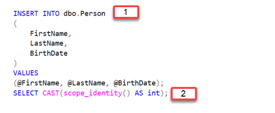
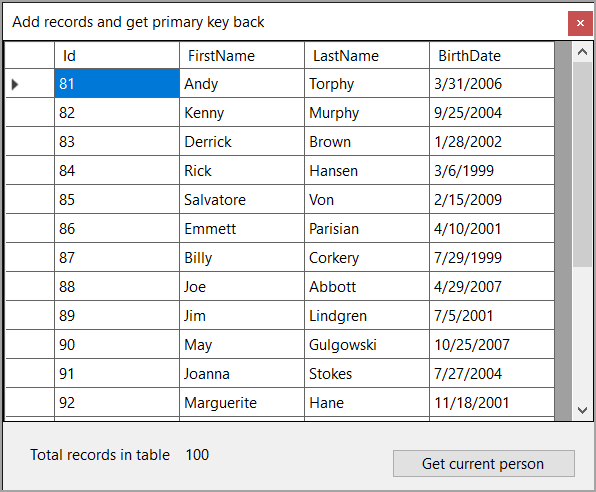

# SQL-Server insert record get primary key back

In this article learn how to insert a new record into a SQL-Server database table and after execution of command return the new primary key.

The reason for obtaining the key would be to be able to reference the new record in perhaps a grid/table in an ASP.NET Core page. For performing bulk inserts the new key typically is not needed.

A Windows Form is used rather than a console or other project type as it is easier and clearer to see results

## Table structure

For this demonstration the following table structure is used.

```sql
CREATE TABLE [dbo].[Person](
	[Id] [INT] IDENTITY(1,1) NOT NULL,
	[FirstName] [NVARCHAR](MAX) NULL,
	[LastName] [NVARCHAR](MAX) NULL,
	[BirthDate] [DATE] NULL,
 CONSTRAINT [PK_Person] PRIMARY KEY CLUSTERED 
(
	[Id] ASC
)WITH (PAD_INDEX = OFF, STATISTICS_NORECOMPUTE = OFF, 
IGNORE_DUP_KEY = OFF, ALLOW_ROW_LOCKS = ON, 
ALLOW_PAGE_LOCKS = ON, OPTIMIZE_FOR_SEQUENTIAL_KEY = OFF) ON [PRIMARY]
) ON [PRIMARY] TEXTIMAGE_ON [PRIMARY]
```

## Client side model

And is represented client side with the following model.


```csharp
internal class Person
{
    public int Id { get; set; }
    public string FirstName { get; set; }
    public string LastName { get; set; }
    public DateOnly BirthDate { get; set; }
```

## Mocked data

The following method is used to generate data without the Id property set using [Bogus NuGet package](https://www.nuget.org/packages/Bogus/34.0.2?_src=template).

```csharp
internal class BogusOperations
{
    public static List<Models.Person> People(int count = 20) =>
        new Faker<Models.Person>()
            .RuleFor(c => c.FirstName, f => f.Person.FirstName)
            .RuleFor(c => c.LastName, f => f.Person.LastName)
            .RuleFor(c => c.BirthDate, f => 
                f.Date.BetweenDateOnly(new DateOnly(1999,1,1),
                    new DateOnly(2010, 1, 1))).Generate(count);
}
```

## SQL Statement for adding records

First statement for inserting a new record and the second statement gets the newly inserted record's primary key.

**SCOPE_IDENTITY** Returns the last identity value inserted into an identity column in the same scope. A scope is a module: a stored procedure, trigger, function, or batch. Therefore, if two statements are in the same stored procedure, function, or batch, they are in the same scope.



## Code

```csharp
public static List<Person> AddRange()
{

    using SqlConnection cn = new(ConnectionString());
    using SqlCommand cmd = new() { Connection = cn, CommandText = SqlStatements.InsertPeople };

    cmd.Parameters.Add("@FirstName", SqlDbType.NVarChar);
    cmd.Parameters.Add("@LastName", SqlDbType.NVarChar);
    cmd.Parameters.Add("@BirthDate", SqlDbType.Date);

    var bogusPeople = BogusOperations.People();

    cn.Open();

    for (int index = 0; index < bogusPeople.Count; index++)
    {
        cmd.Parameters["@FirstName"].Value = bogusPeople[index].FirstName;
        cmd.Parameters["@LastName"].Value = bogusPeople[index].LastName;
        cmd.Parameters["@BirthDate"].Value = bogusPeople[index].BirthDate;
        bogusPeople[index].Id = Convert.ToInt32(cmd.ExecuteScalar());
    }

    return bogusPeople;
}
```

### Code run down

1. Create a connection with the connection string read from appsettings.json using NuGet package [ConfigurationLibrary](https://www.nuget.org/packages/ConfigurationLibrary/1.0.4?_src=template).
1. Create a new command with the SQL statement in the class SqlStatements which is shown in the above image.
1. Create parameters for the command. This is done wrong by many where they create parameters with AddValue and tend to create the parameters inside a for or foreach. See [AddWithValue is Evil](https://www.dbdelta.com/addwithvalue-is-evil/).
1. Get mocked data into a list of Person.
1. Open the connection
1. Using a for statement set values to the command parameters.
1. Execute the statements where using cmd.ExecuteScalar() returns the result of the secondary SQL statement as an object is than cast to an int and set the current Person in the list Id property.

## Window form

```csharp
public partial class Form1 : Form
{
    private BindingList<Person> _personList;
    private BindingSource _bindingSource = new();
    public Form1()
    {
        InitializeComponent();

        // newly added records
        _personList = new BindingList<Person>(DataOperations.AddRange());
        _bindingSource.DataSource = _personList;
        dataGridView1.DataSource = _bindingSource;

        // get total count of records
        CountLabel.Text = DataOperations.PeopleCount().ToString();

    }
    /// <summary>
    /// How to get the current person
    /// </summary>
    private void GetCurrentPersonButton_Click(object sender, EventArgs e)
    {
        Person person = _personList[_bindingSource.Position];

        MessageBox.Show($@"{person.Id} {person.FirstName} {person.LastName} {person.BirthDate}");
    }
}
```

1. Setup a BindingList and BindingSource components to present data
1. Read data into the BindingList
1. Assign the BindingSource.DataSource to the BindingList which by using the Position property of the BindingSource we can index into the BindingList to get at a Person with any type casting and no need to touch rows and cells in the DataGridView.

> **Note**
> If the application is executed multiple times only the last 20 rows show in the DataGridView.

In the screenshot below, note the label, bottom left corner of the form, the record count is shown.



## EF Core

Upon added a new record, the instance of a model will have the primary key set.

## Dapper

Requires [Dapper Plus](https://dapper-plus.net/) to get the new primary key.

## Source code

Is in this [project](https://github.com/karenpayneoregon/sql-basics/tree/master/InsertNewRecordApp) in a GitHub [repository](https://github.com/karenpayneoregon/sql-basics)

## Before running the project

Run the following [script](https://github.com/karenpayneoregon/sql-basics/blob/master/InsertNewRecordApp/Scripts/databaseCreateScript.sql) to create the required localDb database.